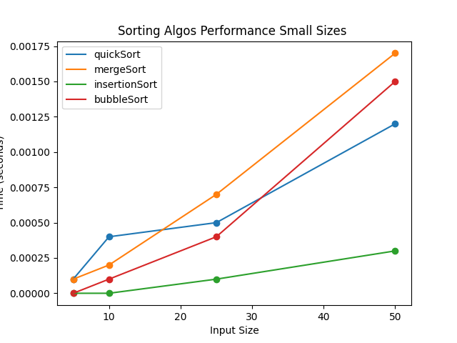

# **Task 1 A**

### Bubble Sort

Bubble Sort is a straightforward comparison-based algorithm that repeatedly iterates through the list, compares neighboring elements, and swaps them when they are out of order.

**Time Complexity:**

- Best Case: O(n)

- Worst Case: O(n^2)

**Space Complexity:** O(1)

### Insertion Sort

Insertion Sort gradually builds the final sorted array by comparing each element and inserting it into its correct position one at a time.

**Time Complexity:**

- Best Case: O(n)

- Worst Case: O(n^2)

**Space Complexity:** O(1)

### Merge Sort

Merge Sort is a divide-and-conquer algorithm that splits the array into two halves, recursively sorts each half, and then combines the sorted halves back together.

**Time Complexity:**

- Best Case: O(nlogn)

- Worst Case: O(nlogn)

**Space Complexity:** O(n)

### Quick Sort

Quick Sort is a divide-and-conquer algorithm that selects a pivot element, splits the array into partitions based on the pivot, and then recursively sorts each partition.

**Time Complexity:**

- Best Case: O(nlogn)

- Average Case: O(nlogn)

- Worst Case: O(n^2) _(when the pivot is the smallest or largest element)_

**Space Complexity:** O(logn) _(recursive stack calls)_

### Performance Analysis

The performance of each sorting algorithm was tested using small and large sets of arrays. The following graphs show the running times of algorithms compared to each other with respect to input sizes.  

From the graph above we can see that for large datasets Quick Sort and Merge Sort works much faster than Bubble Sort and Insertion Sort.

But when comes to small datasets we can notice that Bubble Sort and especially Insertion Sort works much efficient than Merge Sort and Quick Sort

# **Task 1 B**

The task was that we were given a file with the shuffled data which needed to be sorted by ExpiryDate and Pin codes respectively and we should use a linear algorithm to sort. Counting Sort was chosen for this purpose

### Counting Sort

Counting Sort is a non-comparison sorting algorithm that organizes elements by counting the frequency of each unique value in the input array. It is particularly efficient for sorting integers or categorical data with a limited range of possible values.  
**Time Complexity:** O(n+k) _(n is the number of elements, k is the range of input values)_  
**Space Complexity:** O(n+k)

### Steps:

1. Read all data from both files
2. Sort second part with Count Sort algorithm by PIN
3. Sort sorted part with Count Sort algorithm by Expiry Date
4. Merge first part and sorted part
5. Save to file

### Comparison

Below is the graph of comparison of linear sort and log-linear sort algorithms:

As predicted we can see that Count Sort (which is linear) works much faster than other two log-linear sort algorithms.

We can also notice that Quick Sort works faster than Merge Sort as it works in-place without copying elements into temporary array as it is done in Merge Sort .

# **Task 2**

The task was to implement own dynamic resizing array.

### Vec:

Access: O(n)  
Insertion: O(n) _(amortized)_

**Fields:**  
Cap \- for capacity  
Len \- to store length of array  
Mem \- pointer to array of elements

**Methods:**  
Size \- returns length of array  
Vol \- returns capacity  
Get \- returns reference of value at the specified index, which also enables assigning new element  
Resize \- modifies cap of array  
Pop \- removes last element by decreasing the length  
Remove \- removes element at the specified index  
Remove_seg \- removes elements at the specified range (inclusive both sides)  
Push \- adds new element at the end of element

### Analysis

From both csv files we can see that both my implementation and standard lib vector works pretty similar especially when comes to resizing the capacity of array, though std::vector a bit slower probably because of more advanced and complete implementation of it  

