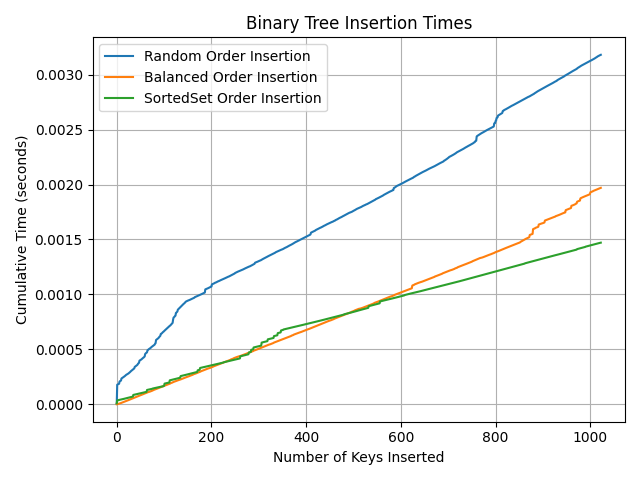
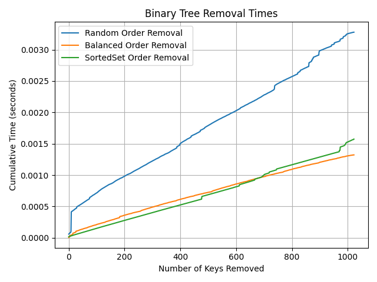
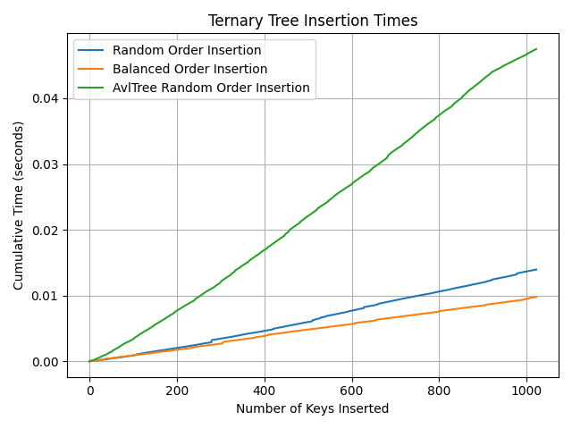
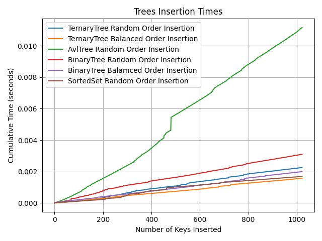

# **Task 1**

### a) Binary Tree (Original Random Order)

**Description:**

In this approach, keys are inserted into a binary tree in a random order. A binary tree does not guarantee balance, so each key is inserted following the rules of a binary search tree (BST):

* Insert to the left if the new key is smaller than the current node's key.

* Insert to the right if the new key is greater than the current node's key.

This can result in a highly unbalanced tree, potentially resembling a linked list if the keys are sorted. While the average insertion time complexity is O(log n) for a balanced tree, it can degrade to O(n) in the worst case if the tree becomes skewed.

**Algorithm:**

* Shuffle the set of keys randomly.  
* Insert each key into the binary tree while maintaining the BST property.  
* Measure insertion time.

### b) Binary Tree (Best-case Order)

**Description:**

In this approach, the keys are rearranged before insertion to ensure the tree remains balanced. The insertion starts with the root node, followed by the children, grandchildren, and so on, maintaining a perfectly balanced tree.

* A perfectly balanced binary tree has a height of log₂(n), where n \= 2^m − 1\.

* The insertion order is selected so that each key is inserted in a way that keeps the tree balanced, ensuring no node is inserted before its parent.

This method minimizes the height of the tree, leading to optimal insertion times of O(log n) for each key.

**Algorithm:**

* Sort the keys in ascending order.  
* Recursively build the tree by first inserting the middle element as the root, then inserting the middle elements of the left and right halves as children, continuing this process for each subtree.  
* Measure the total insertion time.

### c) Library Solution (SortedSet)

**Description:**

This approach utilizes the SortedSet from the sortedcontainers library. A SortedSet is implemented similarly to a balanced binary search tree (BST), maintaining the elements in sorted order. It ensures that elements are inserted and retrieved in O(log n) time, thanks to its self-balancing nature. Unlike standard Python sets, which are hash-based and have average O(1) insertion time but do not maintain order, SortedSet keeps elements sorted at all times, making it ideal for operations where order is important.

**Algorithm:**

* Insert each key into the SortedSet.  
* Measure the total insertion time.

From chart above we can see that:

1. **Random Order Insertion (Blue Line)**:  
   * This approach shows the slowest cumulative insertion time as the number of keys increases. This is due to the potential unbalancing of the binary tree when keys are inserted randomly.  
   * The random order can result in a highly unbalanced tree in some cases, with the height approaching O(n)O(n)O(n), degrading insertion performance to linear time in the worst case.  
2. **Balanced Order Insertion (Orange Line)**:  
   * The balanced binary tree performs better than the random order binary tree. By prearranging the keys to maintain a balanced structure, this approach ensures that the tree's height remains logarithmic (log⁡2(n)\\log\_2(n)log2​(n)).  
   * Consequently, insertion times are optimized, as the tree's structure allows for efficient placement of new nodes.  
3. **SortedSet Insertion (Green Line)**:  
   * The SortedSet approach, which uses a self-balancing BST, consistently performs the best across all input sizes. This is due to its well-maintained balance and efficient insertion mechanism.  
   * The library's implementation likely includes highly optimized balancing algorithms and memory allocation strategies, resulting in consistently low insertion times.

# **Task 2**

### Removing Key

In a Binary Search Tree (BST), the key removal process involves three main steps:

1. Locate the node to delete: Traverse the tree to find the node. On average, this operation is O(log n), but it can degrade to O(n) in the worst case when the tree is unbalanced (e.g., in a skewed tree).

2. Handle node deletion:

   * If the node has no children, simply remove it.

   * If the node has one child, the child replaces the node.

   * If the node has two children, replace the node with its in-order successor or predecessor, then delete the successor’s key.

3. Rearrange the tree: After deletion, the tree may lose its search properties and may require reorganization.

In a balanced tree (with height O(log n)), the deletion operation remains efficient. However, in an unbalanced tree, the time complexity for finding the node to delete can increase to O(n) due to deep recursion and uneven node distribution.

From chart above we cann conclude that:

1. **Random Order Removal (Blue Line)**:  
   * This approach is the slowest, as the cumulative time grows significantly with the number of keys removed. The reason lies in the potential unbalanced nature of the random-order binary tree.  
   * In the worst-case scenario, the tree can degrade into a linked list, resulting in a height of O(n)O(n)O(n). This leads to linear time complexity for removals, causing the observed performance lag.  
2. **Balanced Order Removal (Orange Line)**:  
   * The balanced binary tree consistently performs better than the random-order binary tree. By maintaining a height of O(log⁡n)O(\\log n)O(logn), the removal operation remains efficient, even as the number of keys grows.  
   * The tree's structure minimizes the time spent searching for and removing keys, ensuring more consistent performance compared to the random-order tree.  
3. **SortedSet Removal (Green Line)**:  
   * The library-based SortedSet, which uses a self-balancing structure, performs similarly to the balanced binary tree, with slightly better efficiency in some cases.  
   * The SortedSet maintains balance automatically and ensures logarithmic complexity for removal. However, additional overhead from internal balancing operations (like rotations and memory management) could explain minor differences in performance.

# **Task 3**

**Ternary Tree**  
 A ternary tree is a tree structure where each node can have up to three child nodes, typically referred to as the left, middle, and right child. Unlike binary trees, which allow only two children per node, ternary trees can represent more complex hierarchical relationships at each level.

* **Key Features:**  
  * Each node can have 0 to 3 children.  
  * Does not enforce strict ordering rules like BSTs.  
  * Variants include ternary search trees, where the middle child represents equal keys.  
  * **Example Use Case:** Ternary search trees are commonly used for efficient string storage and retrieval, such as in spell-checking or autocomplete systems.

In my implementation of Ternary Tree each node has two keys, and a value less than first key goes to left, between keys middle (inclusive), greater than second key right. If there is no second key yet in the node it assigns new val inserting to the second key and swaps places with the second key if the first key is greater than second.

**AVL Tree**  
 An AVL tree is a self-balancing binary search tree (BST) where the height difference (balance factor) between the left and right subtrees of any node is at most 1\. If the balance factor exceeds 1 or drops below \-1, rotations (single or double) are performed to restore balance.

* **Key Features:**  
  * Maintains balance for efficient operations.  
  * Guarantees O(log n) time complexity for search, insertion, and deletion.  
  * Named after its inventors, Adelson-Velsky and Landis.  
  * **Example Use Case:** Databases, where fast access and frequent updates are required.

We can observe that the AVL tree tends to be slower due to the rotations required for maintaining balance. On the other hand, the balanced ternary tree is the fastest among them for several reasons.

Compared to binary trees, ternary trees can achieve better cache locality because they involve fewer levels of recursion and use memory more efficiently, especially when the data naturally partitions into three segments. Additionally, the ternary tree has a reduced height because each node can have three child nodes, resulting in a time complexity of O(log₃n), whereas a binary tree has a time complexity of O(log₂n).

### Ternary Tree Vs Binary Tree

We can find out from the graph below that Ternary Tree inserts faster than Binary Tree:  

The main reason for that is the fact that the depth of Ternary Tree tends to be smaller than Binary Tree which makes it faster when it comes to finding the right node.