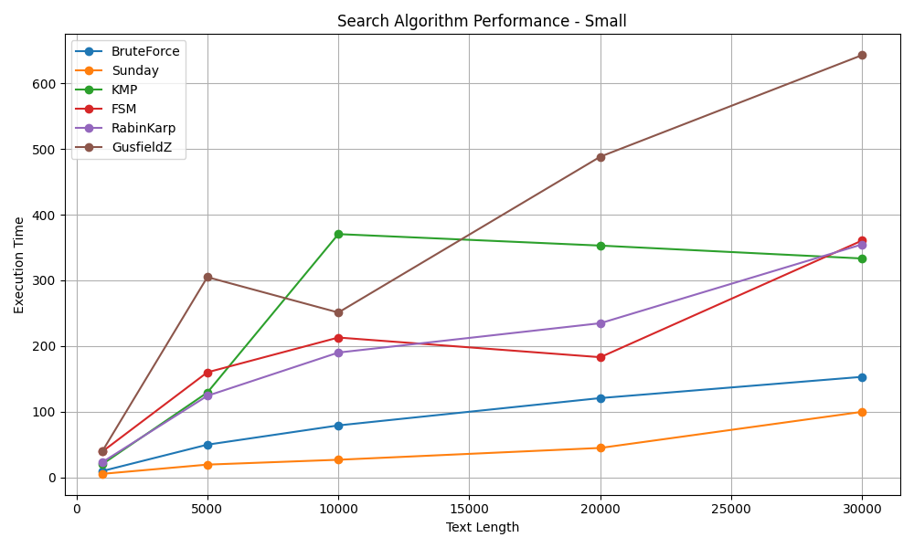
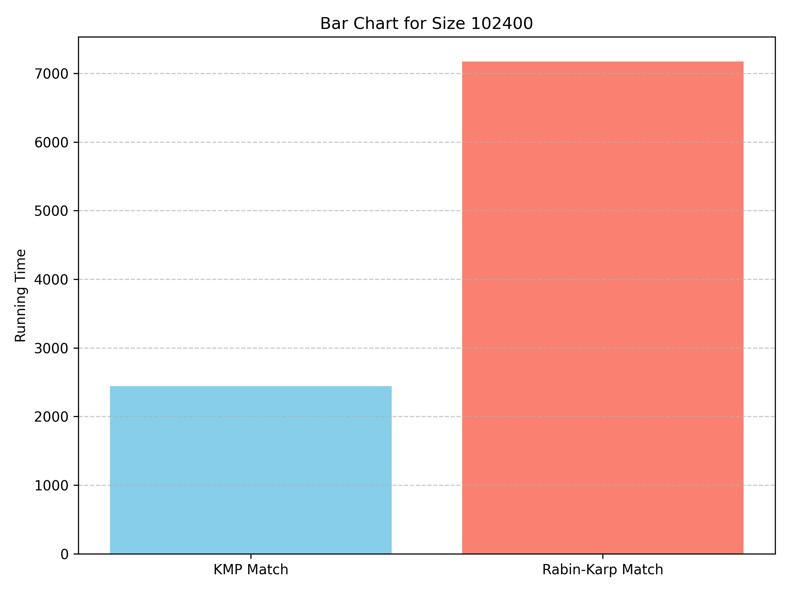
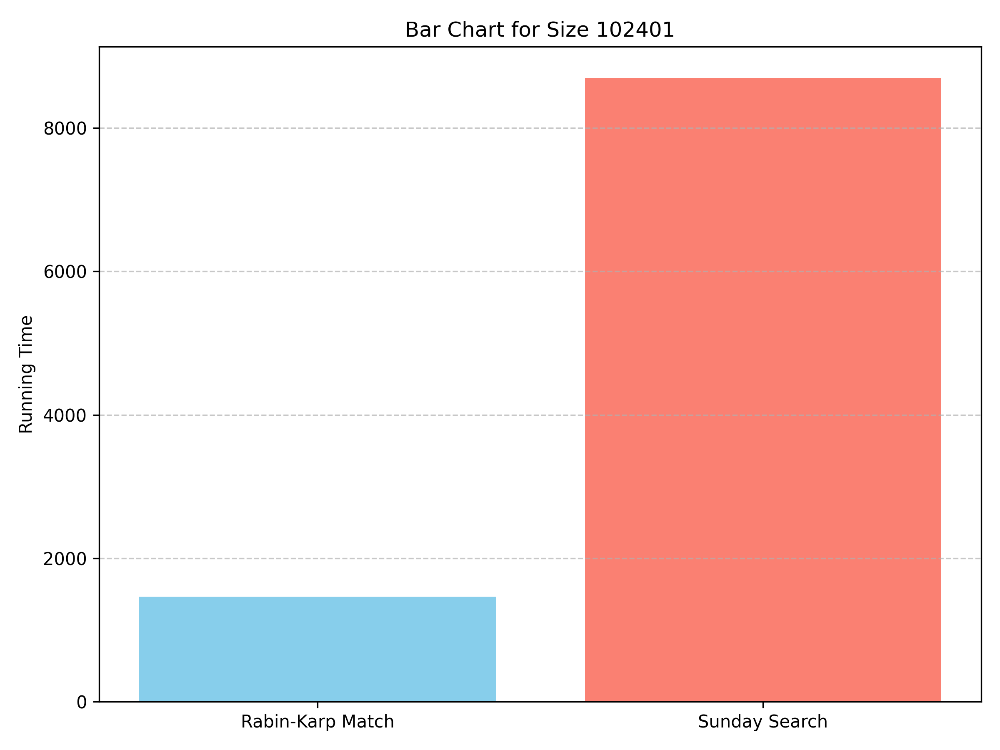

# **Part One A**

This report includes the implementation of several pattern matching algorithms such as Brute-force, Sunday, KMP, Rabin-Karp, Gausfiled’s Z and FSM. Comparison of performance of these algorithms was made in finding a pattern inside a text string. Each of the algorithms has  
unique approach and efficiency depending on the text and pattern used. Measurement of the runtime of each algorithm was made to compare their performance and show them in the graph.

## 

### Brute-Force

Brute-Force algorithms are a straightforward approach to pattern matching by systematically checking all possible positions in the text for a potential match. At each position, it compares the pattern character-by-character with the substring of the text. This method is easy to implement and understand but inefficient for large inputs due to its high time complexity.

**Time Complexity:**

* Best Case: O(n)

* Worst Case: O(nm)

**Space Complexity:** O(1)

### Sunday Algorithm

The Sunday algorithm is an efficient variation of the Brute-Force method. It shifts the pattern based on the character in the text immediately following the current window, using a precomputed shift table. If the character is not in the pattern, the pattern can be shifted past it entirely. This often leads to fewer comparisons and faster performance, especially when mismatches are frequent.

**Time Complexity:**

* Best Case: O(n / m)

* Average Case: O(n)

* Worst Case: O(nm)

**Space Complexity:** O(σ) (σ \= size of the alphabet)

### Knuth-Morris-Pratt (KMP)

KMP is a linear-time pattern matching algorithm that avoids re-checking matched characters by using a prefix table. This table helps determine how far the pattern should shift on a mismatch, based on the longest prefix that is also a suffix. This significantly improves efficiency over naive methods.

**Time Complexity:**

* Best Case: O(n \+ m)

* Worst Case: O(n \+ m)

**Space Complexity:** O(m)

### Finite State Machine (FSM)

FSM-based pattern matching constructs a deterministic finite automaton from the pattern. This automaton processes each character of the text exactly once, making transitions between states. Although the preprocessing step can be costly, the actual search is very efficient and done in linear time.

**Time Complexity:**

* Best Case: O(n \+ m)

* Worst Case: O(n \+ m)

**Space Complexity:**  O(m \* σ) (σ \= size of the alphabet)

### Rabin-Karp

Rabin-Karp uses hashing to compare the pattern with substrings of the text. It computes a hash for the pattern and for each window of the text. If the hashes match, it performs a direct comparison to confirm. The algorithm is particularly efficient when searching for multiple patterns but may suffer from hash collisions, increasing the worst-case runtime.

**Time Complexity:**

* Best Case: O(n \+ m)

* Worst Case: O(nm)

**Space Complexity:** O(1) or O(n) (if storing all hashes)

### Gusfield Z Algorithm

The Z algorithm preprocesses the concatenated string (pattern \+ "$" \+ text) and computes a Z-array, which at each position gives the length of the longest substring that matches the prefix of the pattern. This enables efficient pattern matching in linear time. It is especially useful in bioinformatics and large-scale text analysis.

**Time Complexity:**

* Best Case: O(n \+ m)

* Worst Case: O(n \+ m)

**Space Complexity:** O(n \+ m)

### Performance Analysis

The performance of each algorithm was tested using small and large patterns on different sizes of text which were taken from real world samples like book chapters. The following graphs show the running times of algorithms compared to each other with respect to text sizes. To reduce the noise every algorithm was run 20 times and the average of their run time was taken.



From the graph above we can see that for small patterns: 

* **Sunday Algorithm** consistently shows the best performance with small patterns, being the fastest across all text lengths.  
* **Brute-Force** performs surprisingly well for shorter texts but scales poorly with increased length.  
* **KMP and FSM** show high runtimes, likely due to preprocessing overheads that don’t pay off with small patterns.  
* **Rabin-Karp** and **Gusfield Z** tend to perform the worst as text length increases, especially the Z algorithm due to its heavier preprocessing cost of text \+ pattern.


But when comes to large text size we can see that:

* **Sunday Algorithm** again proves to be the most efficient for large patterns, maintaining very low runtimes across all text sizes.  
* **KMP** becomes more competitive with larger patterns but is still outpaced by Sunday in every case.  
* **FSM** is the least efficient, with extremely high runtimes due to the cost of automaton construction, which worsens with pattern complexity.  
* **Rabin-Karp** scales moderately but suffers from overhead related to hashing, and hash collisions may impact performance.  
* **Gusfield Z** continues to be the slowest algorithm for large patterns, showing that its linear complexity on paper does not always translate to practical speed mainly due to heavy preprocessing of text with pattern.

#### Conclusion

The Sunday Algorithm offers the best balance between simplicity and performance, making it a strong general-purpose pattern matching choice. 

Brute-Force remains useful for quick-and-dirty searches in small inputs, while KMP and Rabin-Karp can be situationally efficient. 

FSM and Gusfield Z algorithm, despite their theoretical strengths, often fail to justify their overhead in practical applications. 

This said when it comes to using arbitrary data inputs like DNA sequences those with lower time complexity showed better performance.

*P.S. All the .csv files of graphs were added to the folder shared.* 

# **Part One B**

In the following paragraphs there was made an effort to prove empirically that there can be situations in which:

* Binary Sunday is at least twice as fast as Gusfield Z,  
* KMP is at least twice as fast as Rabin-Karp,  
* Rabin-Karp is at least twice as fast as Sunday.

For this a specific Pattern and a specific Text (with at least 100kB long) were presented for which this happens.

### 

### First \- Binary Sunday vs Gusfield Z. 

Text and Pattern which were chosen for this case:
``` 
T = "aaaatyuiaaaaqweryaaa" * 5120
P = "bbbbbbb"
```


#### Analysis

*Pattern mismatch:* The pattern "bbbbbbb" does not occur at all in the text, which is mainly composed of 'a', 't', 'y', 'u', 'i', etc.

*Binary Sunday* \- Uses bad character heuristics, skipping ahead based on mismatches. When mismatches happen early (as in this case \- the first character always mismatches), it skips ahead quickly. It scans fewer characters, making it very fast in high-mismatch scenarios.

*Gusfield Z Algorithm* \- Builds a Z-array of the text (or a concatenated form like P \+ $ \+ T). Even if the pattern is nowhere in the text, Z still processes every character, making it less efficient here.

#### Conclusion

Binary Sunday is much faster here because it immediately encounters mismatches and can skip quickly, while Gusfield Z pays the cost of preprocessing and full scanning.

### Second \- KMP vs Rabin-Karp

Text and Pattern which were chosen for this case:  
```
T = "abcd" * 25600
P = "abcdabcdabcdabcdabcdabcdabcdabcdabcd"
```



#### Analysis

Highly *repetitive pattern and text.*

*KMP* \- Preprocesses the pattern into a prefix table to reuse partial matches. Works exceptionally well when pattern structure overlaps with text, like here. Guarantees linear time, no hash calculations, and never rechecks characters.

*Rabin-Karp* \- Uses rolling hash, which is good for multiple pattern matching, but here, there's only one pattern, and many positions have similar substrings, so hash collisions can be more frequent. Even in average-case linear time, the constant factors are worse due to hashing.

#### Conclusion

KMP is more efficient in highly repetitive input, like this, because it doesn't redo comparisons or suffer from hash collisions.

### Third \- Rabin-Karp vs Sunday

Text and Pattern which were chosen for this case:
```
T = "a" * 102400 + “b”
P = "aaaaaaaaaaaaaaaaaaaaaaaaaaaaaaaab"
```



### Analysis

Almost the entire pattern matches the text, except the *last character.* The match only happens once, at the very end.  
*Rabin-Karp* \- Efficient here as hashes of most substrings won’t match the pattern’s hash due to the 'b' at the end. Can quickly discard most positions with just hash comparisons. Only recalculates hashes \- not full comparisons \- until a hash matches.  
*Sunday Algorithm* \- Performs full character comparisons in many positions. In the worst case (as here), every shift results in almost a full match, but fails at the last character ('b' vs 'a'). Doesn’t skip much, leading to more comparisons.

### Conclusion

Rabin-Karp is faster here due to efficient rejection of non-matching substrings via hashing, while Sunday suffers because the text almost matches the pattern in every shift.

# **Part Two**

Task was to implement the Brute-force and Sunday algorithms so that they accept wildcards ? and \* and implementation should produce a Boolean value of a match found or not. The wildcards can be escaped with a backslash. So “?” matches any one character while “\*” zero or more any character.

Before implementing algorithms, a function is needed to help to calculate the possible number of characters in a pattern so to use it in the main loop where we subtract pattern length from text length. For this *perp* function was implemented which returns the number that we need to add after subtracting from text length efficiently giving enough room to search all text.

### Brute Force 

1. **Preprocessing:**  
   Calculates number of wildcards in pattern using prep() function  
   Counts \* and escaped characters (\\\*, \\?) to adjust length comparisons  
2. **Matching Process:**  
   Iterates through text character by character  
   For each position, attempts to match entire pattern  
   Handles three special cases:  
   \\ (escape character) \- matches literal \* or ?  
   ? \- matches any single character  
   \* \- matches zero or more characters  
3. **Complexity:**  
   Time Complexity: O(n\*m) where n is text length and m is pattern length  
   Space Complexity: O(1)  
   

**Implementation:**

Step 1: Preprocessing  
Calls prep(pattern) to count the number of wildcards (\*, and escaped \* or ?) in the pattern.  
This count (m) is used to adjust the minimum length required for a possible match.

Step 2: Length Check  
If the text is shorter than the pattern minus the number of wildcards, it immediately returns false.

Step 3: Main Matching Loop  
Iterates through the text, trying to match the pattern at each position.  
For each position:  
Resets pattern index (pi) to 0\.  
Compares each character in the pattern to the corresponding character in the text.

Step 4: Pattern Character Handling  
Escape (\\): If a backslash is found, the next character is treated as a literal (not a wildcard).  
Question Mark (?): Matches any single character.  
Asterisk (\*): If \* is the last character in the pattern, it matches the rest of the text.  
Otherwise, it skips characters in the text until the next pattern character is found.  
Normal Character: Must match exactly.

Step 5: Match Success or Failure  
If the pattern is fully matched, or ends with an unescaped \*, returns true.  
If not, moves to the next position in the text and repeats.

### Sunday Search

1. **Preprocessing:**  
   Creates a shift table for all ASCII characters (256 entries)  
   For each character in pattern, calculates how far to shift when a mismatch occurs  
   Ignores wildcards when building shift table  
2. **Matching Process:**  
   Uses Sunday algorithm's shifting technique for efficiency  
   Similar wildcard handling as brute force:  
   Handles escaped characters (\\\*, \\?)  
   Matches ? with any single character  
   Matches \* with zero or more characters  
   Uses shift table to skip unnecessary comparisons  
3. **Optimization:**  
   More efficient than brute force due to intelligent skipping  
   Shift table allows larger jumps when mismatches occur  
   Time Complexity: Best case O(n/m), Worst case O(n\*m)  
   Space Complexity: O(1) for pattern processing, O(256) for shift table

**Implementation:**

Step 1: Preprocessing  
Calls prep(pattern) to count wildcards, just like in brute force.  
Checks if the text is long enough for a possible match.

Step 2: Shift Table Creation  
Builds a shift table for all ASCII characters.  
For each character in the pattern (except wildcards and escaped wildcards), sets the shift value to allow skipping ahead in the text when a mismatch occurs.

Step 3: Main Matching Loop  
Slides the pattern over the text, starting at each possible position.

At each position:  
Tries to match the pattern to the text, handling wildcards as in brute force.

Step 4: Pattern Character Handling  
Escape (\\): Next character is matched literally.  
Question Mark (?): Matches any single character.  
Asterisk (\*): If at the end, matches the rest of the text. Otherwise, skips text characters until the next pattern character matches.  
Normal Character: Must match exactly.

Step 5: Match Success or Failure  
If the pattern is fully matched, or ends with an unescaped \*, returns true.

Step 6: Efficient Skipping   
If no match, uses the shift table to skip ahead in the text based on the character after the current window. This allows the algorithm to skip unnecessary checks, making it faster than brute force in many cases.

# 

# **Part Three**

Task was to devise a version of Rabin-Karp algorithm which will check if for a given two-dimensional array of arbitrary items M by N large, its top-right K by K corner is duplicated somewhere in the picture. Implementation should replace slow modulo prime operations with faster bitwise mask &'s. Run time of the algorithm must be linear at most as well.

To achieve this rabinKarp2D algorithm(function) follows below steps:

1. Input & Validation  
   Takes a 2D matrix (picture) and block size K.  
   Returns false if K is larger than the matrix dimensions.  
     
2. Hashing Setup  
   Uses two different bases (BASE\_ROW and BASE\_COL) for row and column hashing.  
   Uses a large mask to avoid overflow.  
     
3. Block Hashing  
   Defines compute\_block\_hash, which computes a unique hash for any KxK block starting at (r, c): Hashes each row in the block, then combines these row hashes into a single hash for the block.  
     
4. Block Comparison  
   Defines blocks\_equal to compare two KxK blocks element-wise for exact match (to avoid false positives due to hash collisions).  
     
5. Target Block Hash  
   Computes the hash of the top-right KxK block (target).  
     
6. Search for Matches  
   Iterates over all possible KxK blocks in the matrix (except the top-right one).  
   For each block:

   Computes its hash.  
   If the hash matches the target, performs an exact comparison.  
   Returns true if a match is found.  
     
7. Result  
   Returns false if no matching block is found.