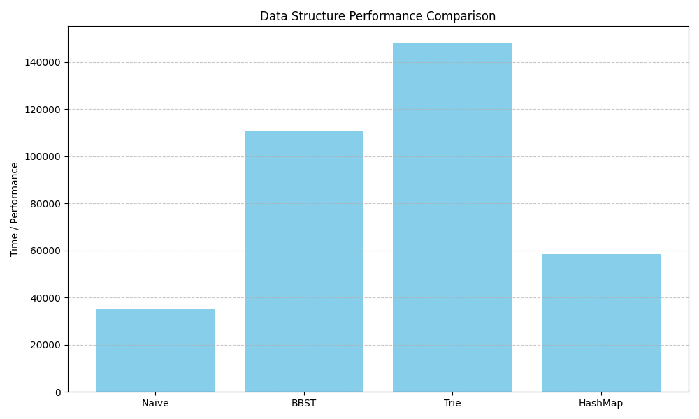
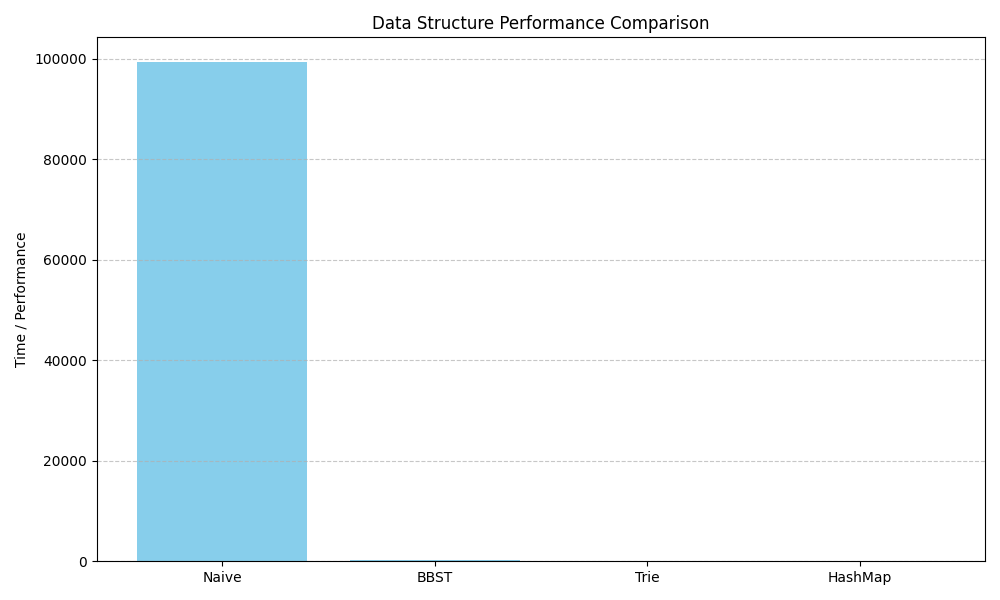
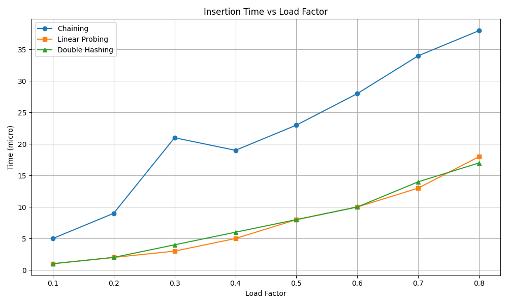
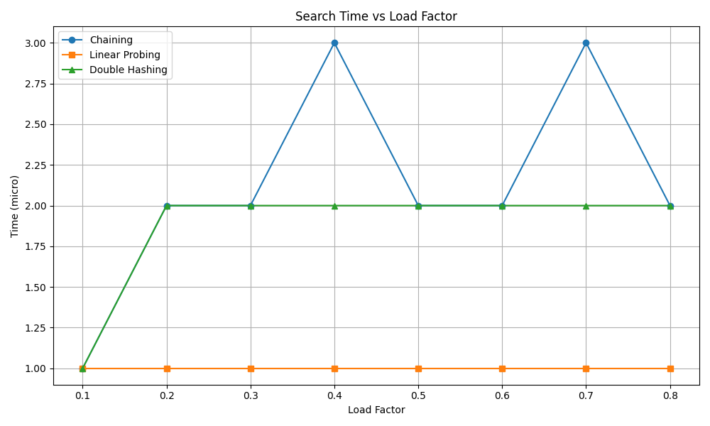

# **Part One A**

Task was to implement a spell checker to verify if each word in a text file is spelled correctly using a given English word list. Four different data approaches were done for this: Naive linear, Balanced Binary Search Tree, Triea and Hash map.

### Naive Approach (Linear List)

**Implementation:**  
The dictionary is loaded into a ` vector<string> `. Spell checking is done by linearly scanning through the entire vector for each word to verify its presence.  
**Build Time:**  
O(N), where N is the number of dictionary words (simply reading and storing them).  
**Check Time:**  
O(M \* N), where M is the number of words to check. Each lookup requires scanning all dictionary words linearly.  
**Summary:**  
This is the simplest approach but the slowest for checking, as each lookup is linear in dictionary size.

### Balanced Binary Search Tree (BBST) Approach (std::set)

**Implementation:**  
The dictionary words are loaded into a balanced BST (std::set\<string\>), which maintains sorted order and allows O(log N) search.  
**Build Time:**  
O(N log N) due to inserting each word into the balanced BST.  
**Check Time:**  
O(M log N), since each lookup takes O(log N).  
**Summary:**  
More efficient than naive for checking, but insertion is more expensive than a vector push\_back.

### Trie Data Structure

**Implementation:**  
A trie (prefix tree) is built by inserting each dictionary word character-by-character. Checking involves traversing the trie nodes.  
**Build Time:**  
O(TotalChars), where TotalChars is the sum of lengths of all dictionary words. Each character insertion is O(1).  
**Check Time:**  
O(S), where S is the total length of all words to check (each character requires a trie traversal step).  
**Summary:**  
Trie offers very fast prefix-based lookups, especially effective if dictionary words share common prefixes. Memory usage is higher due to node overhead.

### Hash Map Approach (unordered\_set)

**Implementation:**  
The dictionary is stored in an unordered\_set\<string\>, which provides average O(1) lookup time.  
**Build Time:**  
O(N), assuming good hash distribution (amortized constant-time insertions).  
**Check Time:**  
O(M), as each word lookup is on average O(1).  
**Summary:**  
This approach is typically the fastest for both building and checking, given efficient hashing and low collisions.

### Observations

**Build Time:**  



Naive has the fastest build time (\~35 seconds). This makes sense because building just involves reading words into a vector with no complex data structure overhead.

HashMap is the second fastest (\~58.5 seconds), reflecting efficient hash insertions.

BBST build time (\~110 seconds) is significantly higher than Naive and HashMap because inserting into a balanced tree involves O(log N) operations for each insertion.

Trie takes the longest to build (\~148 seconds), likely due to character-by-character node insertions and memory allocations for each trie node.

**Spell Check Time:**  
(in microsec)

| Naive | BBST | Trie | HashMap |
| :---- | :---- | :---- | :---- |
| 99305.4 | 226.798 | 127.304 | 37.082 |



Naive is by far the slowest (\~99 seconds), confirming the O(M\*N) complexity where every lookup requires scanning the entire dictionary.

HashMap has the fastest check time (\~37 ms), consistent with average O(1) lookups.

Trie is the second fastest (\~127 ms), showing efficient prefix searches and quick membership checks.  
BBST check time (\~227 ms) is slower than Trie and HashMap but vastly faster than Naive.

### Conclusion

Naive Approach \- Despite the fastest build time, it is impractical for spell checking large texts due to extremely slow lookups. Its linear scan makes it inefficient at scale. BBST \- Provides balanced performance but suffers from relatively long build and moderate check times compared to hash-based structures. Trie \- The slowest to build but offers very efficient lookups, especially beneficial if prefix operations or memory locality optimizations are possible. HashMap \- Offers the best overall performance trade-off with reasonably fast build times and the fastest spell checking. This makes it the most suitable data structure for large-scale spell checking.

# **Part One B**

Task was given the labyrinth map, initial positions of the three competing wizards and their speeds (in corridors per minute),needed to predict which of them will reach the exit first. Assuming that the magical wands used in the play are capable of guiding the wizards to the exit along a shortest possible path. The BFS needs to be used exactly once.

### Solution

Func BFS \- Computes the shortest distance from the exit to every reachable cell in the maze:  
```
vector<vector<int>> bfs(const vector<vector<char>>& maze,  
                        pair<int,  
                        int> exit_pos);
```

**Steps:**

1. Initializes a distance grid with \-1 (unvisited cells).  
2. Starts BFS from the exit position.  
3. Uses a queue to explore the maze level-by-level.  
4. For each valid move (up, down, left, right), updates the distance and enqueue the position.

**Output:**  
Returns a 2D distances grid where each cell contains the shortest number of steps to the exit.

Func Fastest Wizzard \- Determines which wizard reaches the exit first based on shortest distance and individual speed:
```
int find_fastest_wizard(const vector<vector<char>>& maze,
                        const vector<pair<pair<int, int>,
                        double>>& wizards,
                        pair<int, int> exit_pos);
```

**Steps:**

1. Calls bfs to obtain shortest paths to the exit.  
2. Iterates through all wizards:  
   1. For each wizard, gets their position and speed.  
   2. Looks up their shortest path length to the exit.  
   3. Calculates time \= distance / speed.  
   4. Keeps track of the wizard with the minimum time.  
3. Ignores any wizard that cannot reach the exit (distance \== \-1).  
4. 

**Output:**  
Returns the index of the fastest wizard, or \-1 if none can reach the exit.

### Notes

The algorithm runs in O(N \* M) time for the maze traversal and O(W) time for comparing the wizards (where W \= number of wizards).

# **Part Two**

Task was given the list of the invited guests and the corresponding list of suggestions on "who doesn't like whom", task is to use a non-recursive DFS algorithm to set up a two separate tables (sitting scheme).

### Solution

Func canSeatGuests \-  Determines if the guest list can be split into two groups (tables) such that no two guests who dislike each other sit at the same table.  
**Steps:**

1. Builds the Graph \- Each guest is a node. Dislikes are edges between them.  
2. Initializes Colors \- Use a map to mark guest table assignments (-1 means unvisited, 0 and 1 represent two tables).  
3. DFS Traversal (Non-Recursive):  
   1. For each unvisited guest, perform DFS using a stack.  
   2. Assign a color to the guest and the opposite color to all its neighbors.  
   3. If a conflict is found (neighbor already has the same color), return false.  
4. Group Guests \- Based on final colors, split guests into table1 and table2.  
5. Returns true if successful.

**Overall Runtime:**  
O(g \+ d) (linear in number of guests and dislike pairs)

Func prepText \- Reads and parses a text file into a list of words (guest names).  
**Steps:**

1. Reads the file content.  
2. Iterates over each character to form words (ignores punctuation).

**Runtime:**  
O(n) where n is the number of characters in the file.

# **Part Three**

Task was to implement a Hash Table with separate chaining and two HTs with open addressing, e.g. linear probing and double hashing. Then compare the relations between the search/insert times (y-axis) and the load factor (x-axis) for each implementation.

### Implementation

#### Separate Chaining (HashTableChaining)

**Structure:** Uses a vector of `std::list<int>` to handle collisions.  
**Insertion:** Calculates index \= key % size and appends the key to the list at that index if not already present.  
**Search:** Scans the list at the index to find the key.  
**Time Complexity:**  
Average-case: O(1 \+ α), where α is the load factor.  
Worst-case: O(n), if all keys hash to the same index.

#### Linear Probing (HashTableLinearProbing)

**Structure:** Uses a vector of integers with \-1 representing empty slots.  
**Insertion:** Starts at index \= key % size, then linearly probes (index \+ i) % size for the next free or matching slot.  
**Search:** Probes linearly until it finds the key or an empty slot.  
**Time Complexity:**  
Average-case: O(1), increases with α.  
Worst-case: O(n), especially as α → 1 due to clustering.

#### Double Hashing (HashTableDoubleHashing)

**Structure:** Similar to linear probing but uses a second hash function for the probe sequence.  
**Hash functions:**  
`hash1(key) = key % size`  
`hash2(key) = 1 + (key % (size - 1))`  
**Insertion:** Probes using `index = (hash1 + i * hash2) % size`  
**Search:** Same probing strategy until key is found or empty slot.  
**Time Complexity:**  
Average-case: Better than linear probing due to reduced clustering.  
Worst-case: O(n)

#### Benchmarking

Measured total insertion and search time for each method using `std::chrono`  
Uses only the first 50 inserted keys for search benchmarking to ensure consistency.

### Observations

**Insertion Results:**  



Linear Probing starts out fastest and scales smoothly until around α \= 0.6, after which insertion time starts increasing more sharply due to clustering.  
Double Hashing behaves similarly to linear probing, slightly more expensive at lower α but performs better at high α (at α \= 0.8 it’s slightly faster than linear).  
Chaining starts slow and remains consistently more expensive than both open addressing methods for insertion. This is expected because chaining involves dynamic memory allocation (linked list operations).

**Search Results:**



Linear Probing maintains a constant and minimal search time (1μs), which is excellent even at high load factors.  
Double Hashing also has stable search performance but always 1μs slower than linear probing.  
Chaining fluctuates more and shows slightly higher search times, though still low and stable across load factors. This suggests effective distribution but higher overhead due to linked list traversal.

### Conclusion

Linear Probing delivers the fastest and most stable search time across all load factors.It handles load increases well up to around 0.6 without degradation. Double Hashing edges out linear probing at α \= 0.8, indicating it handles high-load insertions more efficiently due to less clustering. Chaining performs worse in insertion time due to overhead from linked list management. Slightly slower search time due to potential traversal of chains, but performance remains relatively stable. More resilient to high load factors (especially \> 1.0, not tested here), since it doesn’t depend on open slots.